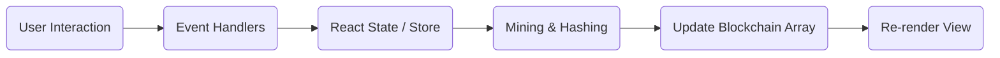

# ChainGuard ID: Blockchain-Based Identity Verification & Network Security

> **Version:** 2.0.0 (Native ML Sentinel Edition)  
> **License:** MIT  
> **Status:** Production / Educational Simulation

---

## 📖 Table of Contents

1. [Project Overview](#-project-overview)
2. [Key Features](#-key-features)
3. [Technology Stack](#-technology-stack)
4. [Installation Guide (Step 0 to 100)](#-installation-guide-step-0-to-100)
5. [Usage Guide](#-usage-guide)
6. [Documentation: Web Application Architecture](#-documentation-part-a-web-application-architecture)
7. [Documentation: Blockchain Implementation](#-documentation-part-b-blockchain-concepts)
8. [Documentation: Network Security & ML](#-documentation-part-c-computer-networks--ml-concepts)
9. [Academic References](#-academic-references)

---

## 🔭 Project Overview

**ChainGuard ID** is a client-side "Zero Trust" security simulation that leverages **Blockchain technology** to solve the "Mutable Log Problem" in network security. 

In traditional systems, attackers often modify server logs (`/var/log/auth.log`) to hide their presence. ChainGuard ID writes every access attempt to a local, immutable blockchain ledger. Additionally, it features a **Heuristic Machine Learning Engine (ML Sentinel)** that analyzes these immutable logs in real-time to detect anomalies like Brute Force attacks, Velocity spikes, and Impossible Travel scenarios without relying on external cloud APIs.

---

## 🚀 Key Features

*   **Immutable Ledger**: Uses SHA-256 hashing and a linked-list data structure to ensure access logs cannot be tampered with.
*   **Heuristic ML Sentinel**: A native, deterministic machine learning engine that scans the chain for statistical anomalies.
*   **Active Firewall**: Allows administrators to blacklist IP addresses directly from the live feed, simulating a Layer 3 firewall drop.
*   **Identity Verification Portal**: A mock login portal that validates users against the blockchain whitelist and the active firewall rules.
*   **Proof of Work Simulation**: Visualizes the mining process required to seal a block of logs.
*   **Real-time Visualization**: Interactive graphs using Recharts to display traffic distribution and threat levels.

---

## 🛠 Technology Stack

| Layer | Technology | Purpose |
| :--- | :--- | :--- |
| **Frontend Framework** | React 19 (TypeScript) | Component-based UI architecture. |
| **Styling** | Tailwind CSS | Utility-first styling for responsive design. |
| **Cryptography** | Web Crypto API (SubtleCrypto) | Native browser implementation of SHA-256. |
| **Visualization** | Recharts | Data visualization for network statistics. |
| **Icons** | Lucide React | SVG iconography. |
| **Build Tool** | Vite | (Recommended) Fast HMR and bundling. |

---

## 📥 Installation Guide (Step 0 to 100)

This guide assumes you are starting from a blank machine.

### Phase 1: Prerequisites

**Step 0: Install Node.js**
1.  Download Node.js (LTS version recommended) from [nodejs.org](https://nodejs.org/).
2.  Verify installation:
    ```bash
    node -v
    npm -v
    ```

### Phase 2: Project Setup

**Step 1: Create Project Directory**
Open your terminal and run:
```bash
npm create vite@latest chainguard-id -- --template react-ts
cd chainguard-id
```

**Step 2: Install Dependencies**
Install the specific libraries required for the visualizer and data handling:
```bash
npm install lucide-react recharts clsx tailwind-merge
```

**Step 3: Configure Tailwind CSS**
Initialize Tailwind:
```bash
npm install -D tailwindcss postcss autoprefixer
npx tailwindcss init -p
```
Update `tailwind.config.js`:
```javascript
/** @type {import('tailwindcss').Config} */
export default {
  content: [
    "./index.html",
    "./src/**/*.{js,ts,jsx,tsx}",
  ],
  theme: {
    extend: {},
  },
  plugins: [],
}
```
Add Tailwind directives to `src/index.css`:
```css
@tailwind base;
@tailwind components;
@tailwind utilities;
```

### Phase 3: Application Code

**Step 4: File Structure**
Ensure your `src` folder looks like this:
```
src/
├── components/
│   ├── BlockchainVisualizer.tsx
│   └── NetworkStats.tsx
├── docs/
│   └── CONCEPTS.md
├── services/
│   └── mlService.ts
├── types.ts
├── App.tsx
├── index.css
├── main.tsx (or index.tsx)
└── vite-env.d.ts
```

**Step 5: Implementation**
Copy the source code provided in the application files into the corresponding files created in Step 4.

### Phase 4: Execution

**Step 6: Run the Development Server**
```bash
npm run dev
```

**Step 7: Access the App**
Open your browser and navigate to `http://localhost:5173`.

---

## 🎮 Usage Guide

1.  **Generate Traffic**: Click **"Simulate Traffic"** in the top right corner. This injects mock logs (Authorized User, Guest, Attacker) into the "Mempool" (Pending logs).
2.  **Mining**: The system automatically "mines" blocks when enough pending logs accumulate. Watch the "Blockchain Explorer" tab to see new blocks appear.
3.  **Active Defense**: 
    *   Go to the **Dashboard**.
    *   In the "Live Access Control Feed", identify a suspicious IP (e.g., `192.168.1.100`).
    *   Click the **Ban/Block Icon** next to it.
4.  **Verify Defense**:
    *   Go to **Identity Portal**.
    *   Try to verify as `sys_admin_01`.
    *   If you blocked the IP simulating the portal, access will be **DENIED**, proving the firewall is active.
5.  **Scan for Threats**:
    *   Go to **ML Sentinel**.
    *   Click **"Scan Network"**.
    *   The heuristic engine will analyze the blockchain and generate a detailed Threat Report.

---

## 📘 Documentation: Part A (Web Application Architecture)

### 1. Architecture Overview
ChainGuard ID follows a **Single Page Application (SPA)** architecture. It does not require a backend server because the "Blockchain" and "Database" are maintained in the client's memory (RAM) via React State for simulation purposes.

### 2. Data Flow Diagram


### 3. Module Interaction
*   **`App.tsx`**: The Controller. It holds the `chain` state, `blockedIPs` set, and handles the `mineBlock` logic.
*   **`mlService.ts`**: Pure functional service. It accepts `Block[]` as input and returns a `ThreatReport` object. It creates no side effects.
*   **`BlockchainVisualizer.tsx`**: A presentational component that renders the linked list visually.

### 4. Authentication Logic
The app simulates **Role-Based Access Control (RBAC)**.
*   **Users**: Defined in a mock registry object.
*   **Check 1 (Firewall)**: Is `request.ip` in `blockedIPs`? If yes, DENY.
*   **Check 2 (Identity)**: Is `user.id` known? Is `user.authorized === true`?
*   **Result**: Write `AccessLog` to pending block with status `GRANTED` or `DENIED`.

---

## 🔗 Documentation: Part B (Blockchain Concepts)

### 1. The Linked List Structure
The core data structure is a singly linked list.
*   **Block**: A container object.
*   **Pointer**: The `previousHash` property serves as the pointer to the parent node.

```typescript
interface Block {
  index: number;
  timestamp: number;
  data: AccessLog[];
  previousHash: string; // The Link
  hash: string;         // The Fingerprint
  nonce: number;        // The Proof of Work counter
}
```

### 2. SHA-256 Hashing (Integrity)
We use the **Secure Hash Algorithm (256-bit)**.
*   **Input**: `JSON.stringify(data) + previousHash + nonce`.
*   **Property**: Deterministic and Avalanche Effect. Changing 1 bit of data changes the hash completely.
*   **Relevance**: If an attacker modifies a log in Block #5, the hash of Block #5 changes. Consequently, Block #6's `previousHash` no longer matches Block #5. The chain is invalid.

### 3. Consensus Mechanism: Proof of Work (PoW)
To prevent spam and simulate computational cost, we implement a basic PoW.
*   **Algorithm**: Find a `nonce` such that `SHA256(block_data + nonce)` starts with a specific prefix (e.g., "0").
*   **Implementation**:
    ```typescript
    while (!hash.startsWith('0')) {
       nonce++;
       hash = generateHash(data + nonce);
    }
    ```
*   This simulates the energy expenditure required to secure public blockchains like Bitcoin.

---

## 📡 Documentation: Part C (Computer Networks & ML Concepts)

### 1. OSI Model References
*   **Layer 3 (Network Layer)**: The "Firewall" feature simulates packet filtering based on IP addresses (`192.168.1.100`).
*   **Layer 7 (Application Layer)**: The logging of "User IDs" and "Actions" represents application-level telemetry.

### 2. Heuristic Anomaly Detection
Instead of a "Black Box" AI, we use **Heuristic Analysis**. This is a rule-based approach to Machine Learning.

#### A. Velocity Analysis (DoS Detection)
*   **Concept**: Detects high-frequency requests from a single source.
*   **Algorithm**:
    1. Bucket logs by `IP Address` within `Time Window T` (e.g., 5 mins).
    2. If `count(logs) > Threshold_Velocity`, flag as **HIGH_VELOCITY**.

#### B. Brute Force Detection
*   **Concept**: Detects repeated authentication failures.
*   **Algorithm**:
    1. Filter logs where `status === 'DENIED'`.
    2. Group by `IP`.
    3. If `consecutive_failures > Threshold_Failures`, flag as **BRUTE_FORCE**.

#### C. Impossible Travel (Suspicious User)
*   **Concept**: A user cannot physically be in two network locations at once.
*   **Algorithm**:
    1. Group logs by `UserID`.
    2. Calculate `Unique IPs` associated with that ID in `Time Window T`.
    3. If `Unique IPs > 2`, flag as **SUSPICIOUS_USER**.

---

## 📚 Academic References

1.  **S. Nakamoto**, "Bitcoin: A Peer-to-Peer Electronic Cash System," 2008. [Online]. Available: https://bitcoin.org/bitcoin.pdf. (Foundational paper for Blockchain structure and Proof of Work).
2.  **D. F. Ferraiolo and D. R. Kuhn**, "Role-Based Access Control," in *15th National Computer Security Conference*, 1992. (Foundational paper for the RBAC model used in verification).
3.  **J. P. Anderson**, "Computer Security Threat Monitoring and Surveillance," James P. Anderson Co., Fort Washington, PA, Tech. Rep., 1980. (The seminal paper defining the concept of analyzing audit trails for intrusion detection).
4.  **G. Zyskind, O. Nathan, and A. Pentland**, "Decentralizing Privacy: Using Blockchain to Protect Personal Data," in *2015 IEEE Security and Privacy Workshops*, San Jose, CA, 2015, pp. 180-184. doi: 10.1109/SPW.2015.27. (Relevant to the core concept of blockchain-based identity management).
5.  **A. Dorri, S. S. Kanhere, R. Jurdak, and P. Gauravaram**, "Blockchain for IoT Security and Privacy: A Case Study," in *2017 IEEE International Conference on Pervasive Computing and Communications Workshops (PerCom Workshops)*, Kona, HI, 2017, pp. 169-174. (Establishes the precedent for using blockchain to secure network nodes).
6.  **W. Meng, W. Z. Tischhauser, Q. Wang, Y. Wang, and J. Han**, "When Intrusion Detection Meets Blockchain Technology: A Review," in *IEEE Access*, vol. 6, pp. 10179-10188, 2018. doi: 10.1109/ACCESS.2018.2799854. (Directly relevant to the "ML Sentinel" feature, discussing how IDS can leverage blockchain).
7.  **L. Xu, L. Chen, N. Shah, Z. Gao, and Y. Lu**, "A Blockchain-Based Approach for Secure Logging in Distributed Systems," in *2018 IEEE 22nd International Conference on Computer Supported Cooperative Work in Design (CSCWD)*, Nanjing, 2018, pp. 716-721. (Directly validates the "Immutable Log" architecture used in ChainGuard ID).
8.  **S. Rose, O. Borchert, S. Mitchell, and S. Connelly**, "Zero Trust Architecture," NIST Special Publication 800-207, 2020. (Standard defining the Zero Trust principles simulated in this app).
9.  **V. Chandola, A. Banerjee, and V. Kumar**, "Anomaly detection: A survey," in *ACM Computing Surveys*, vol. 41, no. 3, pp. 1–58, 2009. (Reference for the statistical anomaly detection methods used in the ML Service).

---

*Documentation generated by ChainGuard Development Team.*